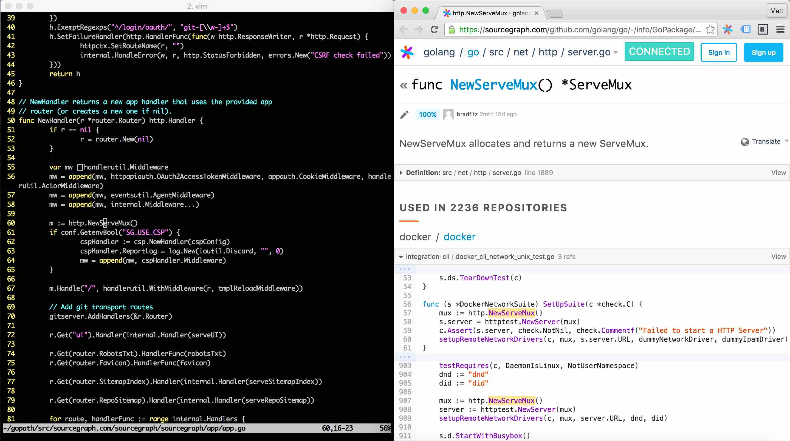

# Sourcegraph for Vim [](https://circleci.com/gh/sourcegraph/sourcegraph-sublime)

*Sourcegraph for Vim is in beta mode. If you have feedback or experience issues, please email us at help@sourcegraph.com or file an issue [here](https://github.com/sourcegraph/sourcegraph-vim/issues).*

## Overview

Sourcegraph for Vim allows you to view Go definitions on [sourcegraph.com](http://www.sourcegraph.com) as you code, so you can stay focused on what's important: your code. When your cursor is on a Go symbol, it should load in a channel in your browser:



## Setup

To install Sourcegraph for Vim, clone `sourcegraph-vim` into your .vim/bundle folder (assumes you are using a Vim package manager, such as [Pathogen](https://github.com/tpope/vim-pathogen) or [Vundle](https://github.com/VundleVim/Vundle.vim)):

```shell
git clone https://github.com/sourcegraph/sourcegraph-vim.git ~/.vim/bundle/sourcegraph-vim
```

## Usage

Sourcegraph for Vim opens a channel in your browser to initialize your Sourcegraph session when in Go files. As you navigate through Go files, enter the Vim command ```:GRAPH``` when your cursor is on a symbol to load its definition and references across thousands of public Go repositories.

## Map a Vim hotkey

To map Sourcegraph for Vim to a hotkey, add a remap command to your ~/.vimrc file. For instance, to map F2 to :GRAPH, add the following to ~/.vimrc.
```
nnoremap <F2> :GRAPH<CR>
```

## Flags

Sourcegraph for Vim has a number of flags to customize your experience. To change your Sourcegraph settings, open add the following settings to your ~/.vimrc file.

### GOBIN and GOPATH

To learn more about setting your `GOPATH`, please click [here](https://golang.org/doc/code.html#GOPATH).

Sourcegraph for Sublime searches your shell to find `GOBIN`, the full path of your Go executable. This is typically `$GOROOT/bin/go`. Similarly, Sourcegraph loads your `/bin/bash` startup scripts to search for the `GOPATH` environment variable. If Sourcegraph cannot find your environment variables, or if you would like to use a custom `GOPATH` or `GOBIN`, add them in the ~/.vimrc file as follows:

```
g:SOURCEGRAPH_GOPATH = "/path/to/gopath"
g:SOURCEGRAPH_GOBIN = "/path/to/gobin"
```

### Verbose logging

This setting gives verbose output from Sourcegraph for Sublime to the Sublime Text console, which can be helping when troubleshooting Sourcegraph for Sublime. To open the Sublime console, simply type <kbd>ctrl</kbd>+<kbd>`</kbd>. Different levels of logging are available:

No logging: `0`

Only log symbols identified by godefinfo: `1`

Log network calls: `2`

Log all debugging information: `3`

```
g:SOURCEGRAPH_LOG_LEVEL = 1
```

## Godefinfo

Sourcegraph for Sublime should automatically install `godefinfo` when it loads your settings. If you still receive an error message about `godefinfo` installation, you can install it manually by running the following command:

```shell
go get -u github.com/sqs/godefinfo
```

### Local server

If you want to try Sourcegraph for Sublime on a local Sourcegraph server, you can define its base URL in this file using the key `SOURCEGRAPH_BASE_URL` in the ~/.vimrc file.

```
g:SOURCEGRAPH_BASE_URL = "https://www.sourcegraph.com"
```

## Support

Sourcegraph for Vim has been tested on Vim 7.3, and requires Python 2.X or Python 3.X to be compiled with your Vim installation. To determine if your Vim is compiled with Python, try running ```:python import sys; print(sys.version)``` from within Vim, and verify that it does not throw an error.
